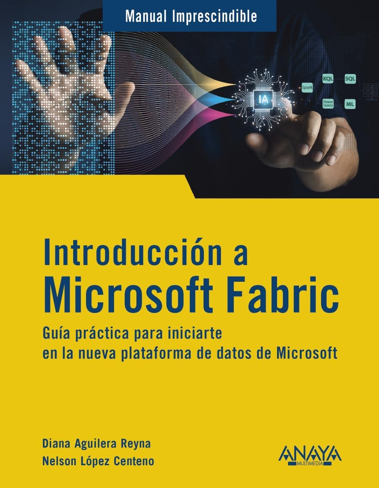

# Materiales del libro "Introducción a Microsoft Fabric"

En este repositorio puedes encontrar los archivos que se utilizan en los ejemplos del libro.

Se puede comprar en:
- [Amazon](https://www.amazon.es/Introducci%C3%B3n-Microsoft-Fabric-plataforma-IMPRESCINDIBLES/dp/8441552754)
- [Casa del Libro](https://www.casadellibro.com/libro-introduccion-a-microsoft-fabric/9788441552753/17518883)
- [Fnac](https://www.fnac.es/a12405970/Diana-Aguilera-Reyna-Introduccion-a-Microsoft-Fabric)
- [El Corte Ingés](https://www.elcorteingles.es/libros/A57094418-introduccion-a-microsoft-fabric-guia-practica-para-iniciarte-en-la-nueva-plataforma-de-datos-de-microsoft/)
- [Librería Agapea](https://www.agapea.com/libros/Introduccion-a-Microsoft-Fabric-9788441552753-i.htm)

